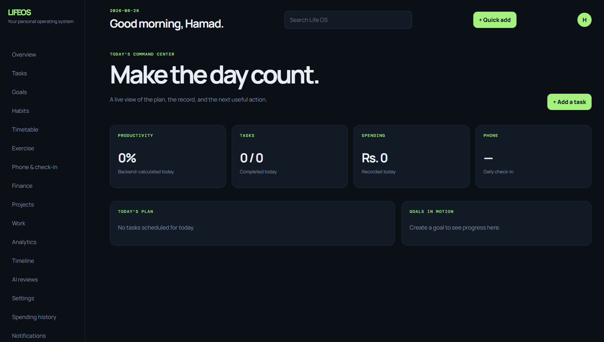

  <strong>PERSONAL LIFE OS</strong>

<h1 align="center">A personal operating system for measurable growth</h1>

  Plan your days, record what actually happened, understand your patterns, and make better decisions with one focused life-management tool.

  <a href="#what-life-os-does">Features</a> ·
  <a href="#quick-start">Quick start</a> ·
  <a href="#how-to-use-the-tool">How to use</a> ·
  <a href="#technology-stack">Technology</a> ·
  <a href="#api-overview">API</a>

---

## What Life OS does

Personal Life OS is a local-first productivity, accountability, finance, health, planning, and reflection tool. It brings the important parts of personal management into one connected workflow:

~~~text
Plan → Execute → Record → Measure → Review → Improve
~~~

Instead of treating tasks, habits, money, exercise, phone usage, goals, and reviews as unrelated lists, Life OS connects them into a historical record of how you spend your time and energy.

The tool helps answer:

- What did I plan to do?
- What did I actually complete?
- How consistent was I?
- Where did I improve?
- Where did I lose momentum?
- What should I focus on next?

## Core experience

### Morning command center

Start the day with a clear view of:

- Today's productivity score
- Tasks due today
- Active goals
- Habits and routines
- Timetable blocks
- Exercise plans
- Phone and spending accountability

### Day-to-day execution

Record real activity as it happens:

- Complete and update tasks
- Log habit performance
- Complete timetable blocks
- Record workouts
- Enter expenses and income
- Add goal contributions
- Record phone usage
- Capture optional mood, energy, sleep, and notes

### Evening reflection

The backend calculates a deterministic daily score and preserves it as a historical snapshot. The AI review then provides qualitative feedback about strengths, weaknesses, patterns, and recommended actions.

### Long-term visibility

Review daily, weekly, monthly, yearly, and historical performance through charts, summaries, timelines, streaks, and growth comparisons.

## Features

### Dashboard

- Today's command center
- Backend-calculated productivity score
- Task completion summary
- Phone usage and spending overview
- Active goal progress
- Today's plan and execution snapshot
- Responsive cards and progress indicators

### Tasks

- Create, edit, complete, defer, cancel, and archive tasks
- Priorities: low, medium, and high
- Due dates and estimated duration
- Actual duration tracking
- Categories, tags, goals, and projects
- Work-task separation
- Recurring tasks
- Inbox views for all, overdue, today, upcoming, and completed tasks
- Timeline events when important task activity occurs

### Goals

- Measurable and qualitative goals
- Target, current progress, unit, priority, category, and deadline
- Goal milestones
- Milestone completion dates
- Progress visualization
- Goal-linked task execution

### Habits

- Structured habit plans instead of simple checkboxes
- Daily, weekly, and custom weekday schedules
- Plan start and end dates
- Daily target and unit
- Minimum acceptable performance
- Preferred time
- Completed, partially completed, skipped, and missed states
- Daily habit instances
- Current streak and longest streak
- Completion rate
- Historical logs
- Contribution-style calendar heatmap

### Exercise

- Reusable exercise plans
- Weekly workout schedules
- Gym, running, walking, cycling, home workouts, and custom exercise types
- Sets, repetitions, weight, duration, distance, calories, and notes
- Workout completion logs
- Planned-versus-completed adherence
- Workout-day and duration analytics

### Timetable and routines

- Daily and recurring schedule blocks
- Start and end times
- Categories, priority, color, and notes
- Actual start and end times
- Completed, partial, and missed states
- Schedule-adherence percentage
- Timetable performance over time

### Phone usage and daily check-in

- Mandatory phone-usage entry can be enabled from Settings
- Optional mood, energy, sleep, and notes
- Timezone-aware daily check-in dates
- Phone usage history
- Phone usage trend analysis
- Configurable phone target minutes

### Spending accountability

Life OS separates financial accountability from ordinary expense entry. The user explicitly confirms each required previous day:

- Confirm recorded expenses
- Add a missing expense before confirming
- Explicitly record that nothing was spent
- Catch up on multiple missed days
- Backend-enforced access gate
- Accountability history
- Accountability rate
- Missed-day count
- Explicit zero-spending days
- Current and longest accountability streaks
- Average daily spending
- Highest spending day

Missing expense records are never interpreted as zero spending. An explicit zero-spending action creates a separate acknowledgement record.

### Finance

- Expense and income records
- Categories and subcategories
- Custom finance categories
- Payment method and notes
- Recurring transaction flag
- Date-based transaction filters
- Net balance
- Total income and expenses
- Spending trends
- Category distribution
- Average daily spending
- Highest spending day and category
- Optional weekly and monthly budgets

### Financial goals

- Savings targets such as a laptop, education, travel, or emergency fund
- Target and current amount
- Deadline
- Percentage completed
- Amount remaining
- Required weekly contribution
- Required monthly contribution
- Contribution notes and dates
- Cumulative contribution history
- Overdue goal detection
- Timeline events for contributions

### Work and projects

- Separate work dashboard
- Projects with status, priority, dates, and tags
- Work tasks connected to projects
- Project milestones
- Project completion percentage
- Project task progress
- Project-specific timeline
- Completed-task and delay visibility

### Analytics and growth

- Daily performance snapshots
- Weekly performance summaries
- Monthly performance summaries
- Yearly performance summaries
- Historical explorer
- Seven-day, thirty-day, ninety-day, yearly, custom, and all-time views
- Productivity charts
- Task, habit, exercise, timetable, phone, finance, goal, and project metrics
- Previous-period comparison
- Growth percentage
- Correlation observations such as phone usage and productivity patterns

### AI personal reviews

- Daily reviews
- Weekly reviews
- Monthly reviews
- Strengths and weaknesses
- Main problems and achievements
- Productivity analysis
- Habit, exercise, finance, phone, and time-management observations
- Recommended next actions
- Stored historical reviews
- Structured response validation
- Server-only AI credentials
- Local fallback review when an external provider is not configured

### Timeline

The global timeline records meaningful events from across the tool:

- Task creation and completion
- Goal and milestone activity
- Habit completion
- Workout completion
- Expenses
- Projects and project milestones
- Phone check-ins
- Financial-goal contributions
- Daily, weekly, and monthly reviews

### Notifications and reminders

- In-app notifications
- Task due reminders
- Phone usage reminders
- Spending accountability reminders
- Habit reminders
- Exercise reminders
- Timetable reminders
- Goal deadline reminders
- Unread count
- Mark as read
- Mark all as read
- Dismiss notifications

### Search and command center

- Global search across tasks, goals, habits, projects, expenses, and timeline events
- Quick add for tasks, expenses, goals, habits, workouts, and phone usage
- Accessible command-center button from the main shell

### Settings

- Name
- Timezone
- Currency
- Week-start day
- Dark, light, and system theme
- Phone-usage requirement
- Spending-accountability requirement
- Phone target minutes
- Productivity score weights

## Technology stack

### Frontend

- React 18.3
- Vite 5
- JavaScript ES modules
- @vitejs/plugin-react
- React Router 6
- Redux Toolkit 2
- React Redux 9
- Axios 1
- Recharts 2
- date-fns 4
- Responsive handcrafted CSS
- Code-split route modules with React lazy loading

### Backend

- Node.js 20+
- Express 4
- Mongoose 8
- MongoDB
- JSON Web Tokens through jsonwebtoken
- bcryptjs for password hashing
- dotenv for environment configuration
- cookie-parser for HTTP-only cookie handling
- cors for controlled frontend/API access
- express-rate-limit for API and AI request protection
- zod for request validation
- Node.js native fetch for external AI communication
- Node.js built-in test runner

### Development and operations

- npm root scripts
- concurrently for running client and server together
- Prettier dependency for formatting support
- Docker
- Docker Compose
- Nginx for serving the built React client
- MongoDB Compass for local database inspection

### Styling and visual system

- Responsive CSS layout
- Dark and light theme variables
- CSS grid and flexbox
- Recharts data visualizations
- Progress bars, cards, heatmap cells, timeline rows, and responsive forms

## System architecture

~~~text
┌──────────────────────────────────────────────────────────────┐
│ React + Vite client                                          │
│ Router · Redux Toolkit · Axios · Recharts · Responsive CSS   │
└───────────────────────────────┬──────────────────────────────┘
                                │ HTTP with credentials
                                ▼
┌──────────────────────────────────────────────────────────────┐
│ Express API                                                   │
│ Routes → middleware → controllers → services → models        │
└───────────────┬───────────────────────────────┬──────────────┘
                │                               │
                ▼                               ▼
┌──────────────────────────┐       ┌───────────────────────────┐
│ Local MongoDB             │       │ External AI provider       │
│ Mongoose models           │       │ Server-side AI service     │
│ Historical records        │       │ Validated structured JSON  │
└──────────────────────────┘       └───────────────────────────┘
~~~

### Backend request flow

~~~text
React action
    ↓
Axios request
    ↓
Authentication and accountability middleware
    ↓
Zod validation
    ↓
Controller
    ↓
Domain service
    ↓
Mongoose model and MongoDB
    ↓
Timeline / analytics / notification side effects
    ↓
Consistent JSON response
~~~

The backend owns important calculations, authorization, timezone boundaries, historical snapshots, and accountability rules. The frontend renders those results and provides the interaction layer.

## Data and historical integrity

Life OS uses date-only keys such as 2026-08-17 for calendar concepts and UTC timestamps for events.

Historical performance records are preserved as snapshots:

- DailyPerformance
- WeeklyPerformance
- MonthlyPerformance
- YearlyPerformance

Financial goals keep contribution history as embedded records. Expenses remain in the primary expense collection, while spending-accountability records summarize and acknowledge a day without duplicating the expense ledger.

User-owned documents are filtered by the authenticated user on the backend. Soft deletion is used for records that should no longer appear in active workflows while remaining available for historical integrity.

## Productivity score

The default score weights are:

| Component | Weight |
|---|---:|
| Task completion | 20% |
| Habit completion | 15% |
| Goal progress | 15% |
| Exercise | 10% |
| Timetable adherence | 15% |
| Phone usage | 10% |
| Work completion | 15% |

The backend calculates the score from applicable components and normalizes the available weights. For example, if there is no scheduled exercise on a day, exercise is excluded from that day's weighted calculation instead of being treated as a failure.

The calculated score is stored once per user and date. AI reviews analyze the score; they do not replace or arbitrarily modify the deterministic score.

## Quick start

### Requirements

Install the following before starting:

- Node.js 20 or newer
- npm
- Local MongoDB
- MongoDB Compass for database inspection

MongoDB should be available at:

~~~text
mongodb://127.0.0.1:27017
~~~

### 1. Clone or open the project

Open a terminal in the project root:

~~~powershell
cd "C:\Users\User\Desktop\Personal Life OS"
~~~

### 2. Create environment configuration

Copy the example environment file:

~~~powershell
Copy-Item .env.example .env
~~~

Open .env and configure the values described in Environment variables.

### 3. Install dependencies

~~~powershell
npm run install:all
~~~

### 4. Start MongoDB

Start your local MongoDB service. You can confirm the database connection with MongoDB Compass using the URI from .env.

### 5. Add demo data

The optional seed command creates a usable demo account and sample records:

~~~powershell
npm run seed
~~~

Demo account:

~~~text
Email:    demo@lifeos.local
Password: password123
~~~

### 6. Start the application

Run the frontend and backend together:

~~~powershell
npm run dev
~~~

Open:

~~~text
Frontend: http://localhost:5173
API:      http://localhost:5000
~~~

You can also run each part independently:

~~~powershell
npm run dev:server
npm run dev:client
~~~

## Environment variables

The root .env.example contains the complete configuration template.

| Variable | Purpose | Example |
|---|---|---|
| PORT | Express API port | 5000 |
| NODE_ENV | Runtime environment | development |
| MONGODB_URI | MongoDB connection string | mongodb://127.0.0.1:27017/life_os |
| ACCESS_TOKEN_SECRET | Access-token signing secret | Long random secret |
| REFRESH_TOKEN_SECRET | Refresh-token signing secret | Long random secret |
| ACCESS_TOKEN_EXPIRY | Access-token lifetime | 15m |
| REFRESH_TOKEN_EXPIRY | Refresh-token lifetime | 30d |
| CLIENT_URL | Allowed frontend origin(s) | http://localhost:5173 |
| COOKIE_SECURE | Secure-cookie mode | false locally |
| TRUST_PROXY | Express proxy trust | false locally |
| AI_API_KEY | External AI credential | Provider key |
| AI_API_URL | External AI endpoint | Provider endpoint |
| AI_MODEL | External AI model name | Provider model |
| ENABLE_JOBS | Enable scheduled automation | true or false |

Keep .env private. AI credentials are read by Express and are never sent to the React client.

## MongoDB Compass

1. Open MongoDB Compass.
2. Use the connection string:

   ~~~text
   mongodb://127.0.0.1:27017
   ~~~

3. Open the database named life_os.
4. Inspect collections created by the application and seed script.

Important collections include:

~~~text
users
expenses
tasks
goals
habits
habitlogs
habitinstances
exerciseplans
exerciselogs
timetableevents
projects
projectmilestones
financialgoals
budgets
financecategories
phoneusages
spendingaccountabilities
dailyperformances
weeklyperformances
monthlyperformances
yearlyperformances
aireviews
timelineevents
notifications
refreshtokens
~~~

## How to use the tool

### First login

1. Register a user or use the seeded demo account.
2. Confirm your timezone in Settings.
3. Select your currency.
4. Configure phone and spending accountability preferences.
5. Adjust score weights if desired.
6. Create at least one task, habit, goal, timetable block, or project.

### Daily workflow

1. Open the Dashboard.
2. Review today's tasks, timetable, habits, workout, goals, and work.
3. Use Quick Add when you need to record something quickly.
4. Complete tasks and timetable events as you execute them.
5. Log habit and exercise performance.
6. Record expenses and income.
7. Enter phone usage during the daily check-in.
8. Review your score and timeline.
9. Generate a daily AI review when you want qualitative coaching.

### Financial workflow

1. Record expenses as they occur.
2. Use Finance to inspect spending trends and categories.
3. Create optional budgets.
4. Create a financial goal.
5. Add contributions with dates and notes.
6. Use Spending History to monitor accountability rate and streaks.

### Weekly and monthly workflow

1. Open Analytics.
2. Compare weekly, monthly, yearly, or custom historical periods.
3. Review score, growth, tasks, habits, exercise, phone, finance, timetable, and projects.
4. Inspect correlation observations.
5. Generate a weekly or monthly AI review.
6. Use the timeline to revisit meaningful activity.

## Accountability behavior

The access gate is calculated by the backend using the user's timezone.

On the registration day, normal access is available. On later days, the application determines all required previous dates and checks enabled requirements:

- Phone usage must be recorded for each required date.
- Spending must be explicitly confirmed for each required date.
- Existing expenses can be reviewed and confirmed.
- Missing expenses can be added before confirmation.
- A no-spending day must be explicitly recorded as zero.
- Multiple missed days appear in a catch-up flow.

The relevant API response includes structured requirement details so the client can present the correct action to the user.

## AI configuration

AI requests use this server-side flow:

~~~text
React review action
    ↓
Express review route
    ↓
Review service gathers relevant metrics
    ↓
AI service sends a minimal structured payload
    ↓
Provider returns JSON
    ↓
Response is normalized and validated
    ↓
Historical AI review is saved in MongoDB
~~~

The AI receives performance context such as:

- Deterministic score
- Task completion
- Habit consistency
- Exercise activity
- Timetable adherence
- Phone usage
- Spending summary
- Goal progress
- Project progress
- Historical growth

The AI response is stored with its review type, period, model, prompt version, validation status, summary, strengths, weaknesses, recommendations, and estimated growth.

## Background automation

The backend includes scheduled automation for:

- Recurring task synchronization
- Recurring timetable synchronization
- Habit-instance synchronization
- Daily performance snapshots
- Weekly performance finalization
- Monthly performance finalization
- Yearly performance finalization
- In-app reminders
- Scheduled AI reviews

Enable the hourly local job runner with:

~~~powershell
$env:ENABLE_JOBS="true"
npm.cmd run dev:server
~~~

## API overview

All application endpoints are served under /api and return a consistent response shape.

### Authentication

~~~text
POST /api/auth/register
POST /api/auth/login
POST /api/auth/refresh
POST /api/auth/logout
GET  /api/auth/me
PATCH /api/auth/profile
~~~

### Access and accountability

~~~text
GET  /api/access/status
POST /api/check-ins/phone
GET  /api/check-ins/history
GET  /api/spending-accountability/history
GET  /api/spending-accountability/summary
GET  /api/spending-accountability/:dateKey/preview
POST /api/spending-accountability/:dateKey/confirm
POST /api/spending-accountability/:dateKey/no-spending
POST /api/spending-accountability/:dateKey/add-expense
~~~

### Productivity

~~~text
GET/POST/PATCH/DELETE /api/tasks
GET  /api/tasks?view=TODAY
GET  /api/tasks?view=OVERDUE
POST /api/tasks/sync-recurring

GET/POST/PATCH/DELETE /api/goals
POST /api/goals/:id/milestones
PATCH /api/goals/:id/milestones/:milestoneId

GET/POST/PATCH/DELETE /api/habits
POST /api/habits/:id/log
GET  /api/habits/instances
GET  /api/habits/heatmap
GET  /api/habits/:id/history
GET  /api/habits/:id/stats

GET/POST/PATCH/DELETE /api/timetable
POST /api/timetable/:id/complete
POST /api/timetable/sync-recurring
GET  /api/analytics/timetable-adherence
~~~

### Exercise, work, and projects

~~~text
GET/POST/PATCH/DELETE /api/exercise/plans
GET/POST /api/exercise/logs
GET  /api/exercise/adherence

GET/POST/PATCH/DELETE /api/projects
GET  /api/projects/:id/milestones
POST /api/projects/:id/milestones
PATCH /api/projects/:id/milestones/:milestoneId
GET  /api/projects/:id/timeline
~~~

Work items are represented by tasks with the WORK category and can be linked to projects.

### Finance

~~~text
GET/POST/PATCH/DELETE /api/expenses
GET  /api/finance/transactions
GET/POST/DELETE /api/finance/categories

GET/POST/PATCH/DELETE /api/budgets
GET/POST/PATCH/DELETE /api/finance-goals
POST /api/finance-goals/:id/contributions
~~~

### Analytics, timeline, AI, and utilities

~~~text
GET /api/dashboard/today
GET /api/dashboard/weekly
GET /api/dashboard/monthly
GET /api/dashboard/yearly

GET /api/analytics/daily
GET /api/analytics/weekly
GET /api/analytics/monthly
GET /api/analytics/yearly
GET /api/analytics/history
GET /api/analytics/growth
GET /api/analytics/finance
GET /api/analytics/correlations

GET  /api/timeline
GET  /api/search?q=backend
POST /api/quick-add

GET   /api/notifications
GET   /api/notifications/unread-count
PATCH /api/notifications/:id/read
PATCH /api/notifications/:id/dismiss
PATCH /api/notifications/read-all

GET  /api/ai/reviews
POST /api/ai/daily-review
POST /api/ai/weekly-review
POST /api/ai/monthly-review
~~~

### Response format

Successful response:

~~~json
{
  "success": true,
  "message": "Task created",
  "data": {}
}
~~~

Error response:

~~~json
{
  "success": false,
  "code": "VALIDATION_ERROR",
  "message": "Validation failed",
  "details": []
}
~~~

## Folder structure

~~~text
Personal Life OS/
├── client/
│   ├── public/
│   ├── src/
│   │   ├── App.jsx                    # App shell, auth, route protection, command center
│   │   ├── api.js                     # Axios client and connection handling
│   │   ├── main.jsx                   # React entry point and providers
│   │   ├── store.js                   # Redux Toolkit store and slices
│   │   ├── styles.css                 # Responsive theme and component styles
│   │   └── pages/
│   │       ├── CorePages.jsx          # Dashboard, tasks, goals, habits, timetable
│   │       ├── Phase3Pages.jsx        # Exercise and phone check-in workflows
│   │       ├── ExtendedPages.jsx      # Finance, projects, analytics, reviews, settings
│   │       └── CommandDashboard.jsx   # Today's main dashboard
│   ├── Dockerfile                     # Vite build served by Nginx
│   ├── nginx.conf                     # SPA fallback and static serving
│   ├── package.json
│   └── vite.config.js
│
├── server/
│   ├── src/
│   │   ├── app.js                     # Express app, security headers, health, middleware
│   │   ├── server.js                  # Database startup, HTTP server, automation runner
│   │   ├── db.js                      # Mongoose connection
│   │   ├── config/                    # Environment configuration
│   │   ├── controllers/               # HTTP request handlers
│   │   ├── middleware/                # Auth, accountability, validation, errors
│   │   ├── models/                    # Mongoose schemas and indexes
│   │   ├── routes/                    # REST route definitions
│   │   ├── services/                  # Business logic and domain workflows
│   │   ├── utils/                     # Date, API, recurrence, and schedule utilities
│   │   ├── validators/                # Zod request schemas
│   │   └── seed.js                    # Demo account and sample data
│   ├── test/                          # Business-rule and date tests
│   ├── Dockerfile
│   └── package.json
│
├── .env.example                       # Environment template
├── docker-compose.yml                  # MongoDB, API, and Nginx client stack
├── package.json                        # Root development commands
└── README.md
~~~

## Security model

- Passwords are hashed with bcryptjs.
- Access and refresh tokens use JWT signing secrets.
- Refresh tokens are stored in HTTP-only cookies and represented securely in the database.
- AI credentials remain on the Express server.
- CORS is restricted to configured client origins.
- Request bodies are validated with Zod.
- AI endpoints are rate limited.
- Backend queries always scope user-owned data to the authenticated user.
- Security headers are applied by Express.
- Historical entities use soft deletion where appropriate.
- The server determines timezone-aware accountability dates.

## Docker Compose

The included Compose file starts MongoDB, the Express API, and the Nginx-served React client:

~~~powershell
docker compose up --build
~~~

Services:

~~~text
Frontend: http://localhost
API:      http://localhost:5000
MongoDB:  mongodb://127.0.0.1:27017
~~~

Health endpoints:

~~~text
GET /health
GET /health/live
GET /health/ready
~~~

## Testing and verification

Run the backend test suite from the project root:

~~~powershell
npm.cmd test
~~~

Run the client production build:

~~~powershell
npm.cmd --prefix client run build
~~~

The tests cover important business rules including:

- Timezone-aware date boundaries
- Registration-day accountability exception
- Multi-day accountability catch-up
- Score weighting and normalization
- Expense validation
- Timetable validation and adherence
- Recurrence matching
- Habit schedule and completion states
- Exercise schedule matching
- Task inbox views
- Financial-goal progress and contribution history
- Accountability metrics
- AI response normalization

## Troubleshooting

### MongoDB connection error

Confirm that MongoDB is running and that .env contains:

~~~env
MONGODB_URI=mongodb://127.0.0.1:27017/life_os
~~~

### The frontend cannot reach the API

Check that:

~~~env
CLIENT_URL=http://localhost:5173
~~~

matches the URL used by Vite. For a different API address, set VITE_API_URL in the client environment.

### The application asks for accountability

Complete the phone check-in and explicitly account for each required spending date. Existing expenses can be confirmed, missing expenses can be added, and zero-spending days must be explicitly submitted.

### Scheduled reminders are not appearing

Start the server with jobs enabled:

~~~powershell
$env:ENABLE_JOBS="true"
npm.cmd run dev:server
~~~

### Port already in use

Stop the process using the configured port or choose another value in .env:

~~~env
PORT=5001
~~~

Update the client API URL if the API port changes.

## Customer onboarding checklist

- Install Node.js, npm, MongoDB, and MongoDB Compass.
- Copy .env.example to .env.
- Configure MongoDB and token secrets.
- Install dependencies with npm run install:all.
- Start the application with npm run dev.
- Register an account or run the seed script.
- Set timezone, currency, theme, and accountability preferences.
- Create tasks, habits, goals, routines, projects, and financial targets.
- Record activity consistently throughout the day.
- Review analytics and AI summaries regularly.

## Product philosophy

Life OS is built around a simple operating loop:

~~~text
Plan
  ↓
Follow the timetable
  ↓
Execute tasks and habits
  ↓
Record money, phone usage, exercise, and work
  ↓
Review performance
  ↓
Measure growth
  ↓
Learn and improve
~~~

The objective is not to collect disconnected records. It is to turn everyday decisions into useful feedback that makes personal improvement visible.
